# Triage Policies

A **Triage Policy** is a declarative governance policy over SocTalk's autonomous LLM
triage loop. It shapes *how* an alert is triaged — never *what actions are taken*. It
cannot act, cannot order response steps, and **cannot lower a disposition**. It is not a
SOAR workflow and not a human IR checklist.

> The word **"playbook" is reserved** for a future, separate document kind — **Response
> Playbooks** — the imperative post-disposition workflows (notify / ticket / isolate /
> block) that fire *after* triage commits, outside the agentic loop. Do not use "playbook"
> for the triage-policy kind anywhere in product/UI/docs.

## What a triage policy governs — the six levers

A triage policy binds to alerts (`applies_to`: rule groups / rule ids / authorization
tracks) and expresses up to six governance levers — the first five are available to
tenant-authored policies; the sixth is built-in-only:

1. **Required evidence steps** (`required_steps`) — deterministic graph nodes that MUST run
   before a verdict is legal (e.g. `gather_authorization_context`). Adds rigor; never
   closes.
2. **Deterministic decision modules** (`decision_modules`) — declares the vetted engines a
   policy relies on (today: `authorization_engine`), validated against known modules. It is
   declarative metadata today; the runtime consultation is driven by `required_steps` (e.g.
   `gather_authorization_context`), not by this field.
3. **Per-phase legal action sets** (`legal_actions`) — which supervisor actions are
   permitted in the `triage` vs `decide` phase. An unlisted phase is unconstrained;
   authored policies may not grant `CLOSE` (see below).
4. **Raise-only post-verdict guardrails** (`guardrails`) — a sandboxed condition language
   over the state contract; each guardrail may only `override` a decision **up** the ladder
   `close < needs_more_info < escalate`, or `interrupt` to human sign-off.
5. **Close sign-off classes** (`close_signoff_data_classes`) — a committing close on an
   asset of one of these data classes is interrupted for human sign-off.
6. **Deterministic disposition** (`deterministic_disposition`, built-in policies only) — a
   vetted class close (e.g. operational noise) without an LLM look; every security-indicator
   veto still applies.

## The core invariant: suppression is inexpressible

A triage policy can only make triage **more conservative**, never less:

- Guardrail effects are **raise-only** — `DECISION_RANK` and the `to` enum make `close`
  unreachable; the guard skips any override that isn't strictly higher
  (`soctalk/triage_policy/guard.py`).
- `deterministic_disposition` is a **built-in-only** capability — authored/file policies
  cannot set it (`authoring.py`, `registry.py`), so UI/file authors cannot mint an
  auto-close class.
- The **non-overridable safety floor** (`soctalk/triage_policy/floor.py`) vetoes any auto-close
  over an IOC, an active-incident overlap, or contradicted authorization — regardless of any
  policy.

See the docstrings in `soctalk/triage_policy/models.py` and `DECISION_RANK` for the grammar.

> **Authored `legal_actions` cannot grant `CLOSE`:** a set like `{decide: [CLOSE]}` would
> make the illegal-action remap force every proposal to a verdict-less auto-close standing
> only on the coarse floor. Authored validation (`authoring.py`) rejects `CLOSE` in any
> phase — granting it adds nothing over an unconstrained phase (the baseline already permits
> the router close), so terminal decisions route through `VERDICT`. Built-in/file policies
> may still list the full action set; only the tenant-authored path is constrained.

## Lifecycle

- **Built-in** policies are vetted code (`registry.py`), read-only, always active.
- **File** policies load per-process in the runs-worker from `SOCTALK_TRIAGE_POLICY_DIR`
  (delivered via the tenant chart ConfigMap); default `shadow`.
- **Authored** policies are DB-backed, per-tenant, admin-authored via the API/UI:
  `draft` → `shadow` (evaluated for audit, never enforced) → `active` (governs) →
  `retired`. Activating an authored policy materializes it into the worker's triage-policy
  ConfigMap on a `tenant.reconcile`; the worker rollout is the activation gate.

**Shadow** policies are matched and their guardrails evaluated for audit only — nothing is
enforced. This lets an author observe a policy's would-fire behavior before activating it.

## Tutorial: author a policy in the no-code editor

This walks through building one real, non-trivial policy end to end in the visual editor.
The example — `prod-privileged-exec-strict` — governs privileged-execution alerts
(`sudo`/`su`) on an account-authorization track: it demands authorization evidence, narrows
what the agent may do, and adds raise-only guardrails plus a PCI close gate.

Open **Triage Policies → “+ New triage policy”** (or go to `/triage-policies/editor`). Pin a
tenant first — authored policies are per-tenant. The editor is two columns: the **document
form** on the left, and a live **decision-flow projection** + **“Try it” simulator** on the
right that re-render on every edit.

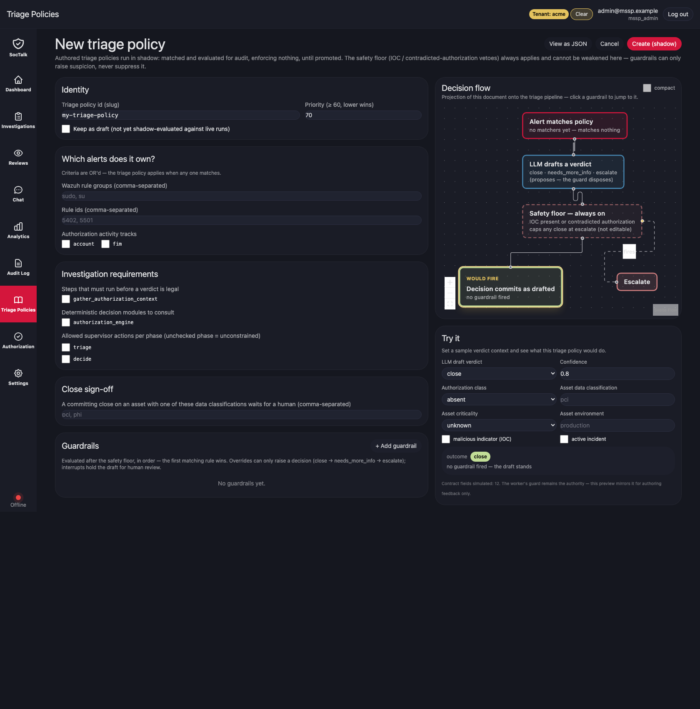

### 1. Identity

Give the policy a slug id and a **priority**. Priority is a floor-gated integer
(`≥ 60`) where **lower wins** on a double match, so authored policies can never outrank the
built-in protections. Leave “Keep as draft” unchecked to author straight into `shadow`.

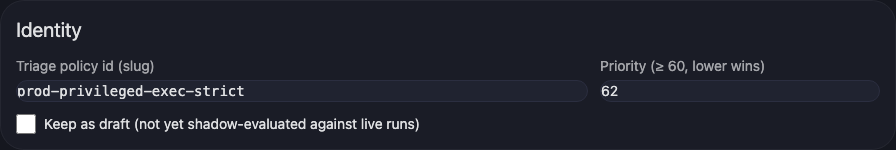

### 2. Which alerts does it own?

Bind the policy to alerts. The three matchers — Wazuh **rule groups**, **rule ids**, and
**authorization tracks** — are **OR’d**: the policy applies when any one matches. Here it
owns `sudo, su, sudoers`, rule ids `5402, 5501`, on the `account` track.

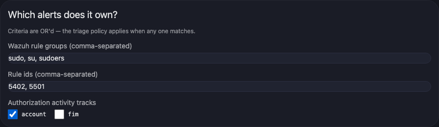

### 3. Investigation requirements

Tighten *how* the alert is worked:

- **Required steps** — `gather_authorization_context` must run before any verdict is legal.
- **Decision modules** — consult the `authorization_engine`.
- **Legal actions per phase** — an unchecked phase is unconstrained. Here the `decide` phase
  is narrowed to `VERDICT` only. Note `CLOSE` is not offered: authored policies cannot grant
  it — terminal decisions route through `VERDICT`, and the always-on floor still governs the
  final close.

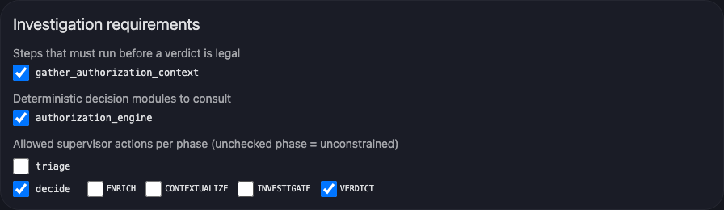

### 4. Close sign-off

List the asset data classes whose *committing close* must wait for a human. A close on a
`pci`- or `phi`-classified asset is interrupted for sign-off.

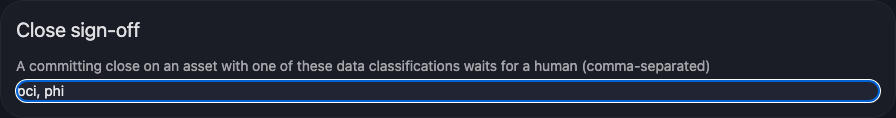

### 5. Guardrails — the raise-only lever

Guardrails run **after** the safety floor, **in order**, first match wins. Each either
**overrides** the decision *up* the ladder (`close → needs_more_info → escalate`) or
**interrupts** for human review. They can never lower a disposition.

Each guardrail’s condition can be authored two ways. The sandboxed condition language is a
small JSON-logic dialect — `{"op": [{"var": "<field>"}, <value>]}` with `and`/`or` groups —
and the editor exposes it directly:

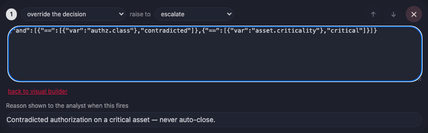

…or with the visual **condition builder**, which round-trips with the JSON. `ALL`/`ANY` maps
to `and`/`or`; each row picks a state-contract field, an operator, and a value. This first
guardrail fires when authorization is **contradicted** *and* the asset is **critical**, and
raises the decision to `escalate`:

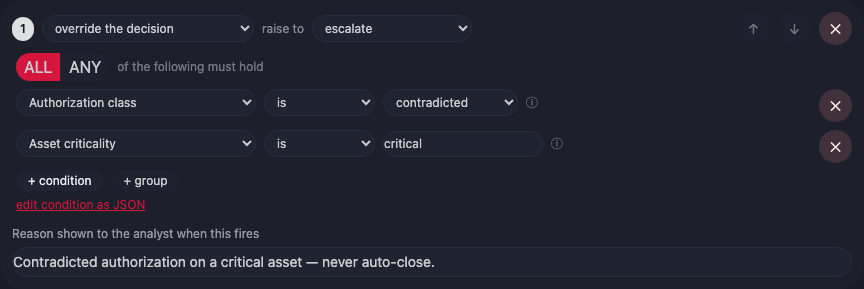

Two more guardrails complete the policy: a low-confidence override to `needs_more_info`, and
an `interrupt` that holds a PCI-classified close for human review. Order matters — the first
matching guardrail disposes.

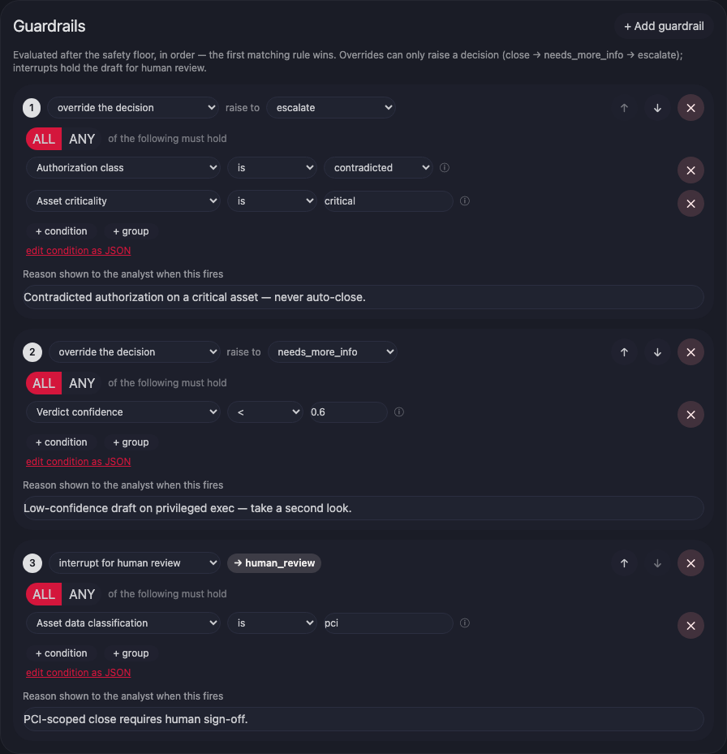

### 6. Read the decision flow, then simulate

The right column projects the whole document onto the triage pipeline — matchers → phases →
LLM draft → **safety floor (always on)** → guardrails in order → close sign-off → commit.
Click any guardrail node to jump to it.

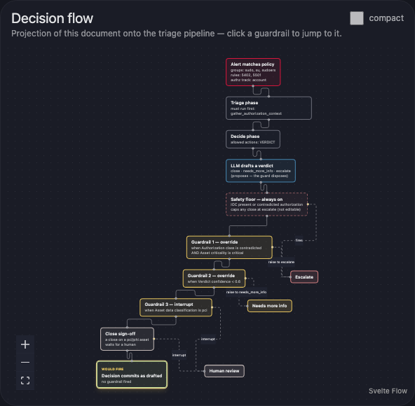

The **“Try it”** panel previews the guardrail + floor logic the editor can model over a sample
verdict context — a subset of the full worker/server/ingest enforcement path, for authoring feedback.
Set a contradicted-authorization, critical-asset scenario and the outcome is `escalate` —
but notice it comes from the **safety floor**, not this policy. That is the core invariant
made visible: contradicted authorization is a non-overridable floor veto, and the policy’s
guardrails can only *raise* on top of it, never suppress it.

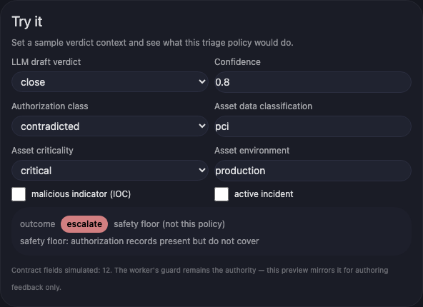

### 7. Save

`Create (shadow)` saves the policy for audit-only evaluation. Watch its would-fire behavior
in shadow, then **activate** it (from the Triage Policies list) to have it govern — activation
materializes it into the worker’s ConfigMap on a `tenant.reconcile`, and the worker rollout is
the gate.

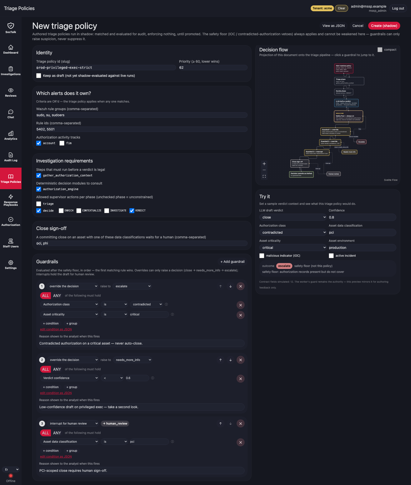

The form and the stored document are the same artifact — “View as JSON” shows exactly what
gets persisted:

```json
{
  "id": "prod-privileged-exec-strict",
  "priority": 62,
  "applies_to": {
    "rule_groups": ["sudo", "su", "sudoers"],
    "rule_ids": ["5402", "5501"],
    "authorization_tracks": ["account"]
  },
  "required_steps": ["gather_authorization_context"],
  "decision_modules": ["authorization_engine"],
  "legal_actions": { "decide": ["VERDICT"] },
  "close_signoff_data_classes": ["pci", "phi"],
  "guardrails": [
    {
      "when": {"and": [
        {"==": [{"var": "authz.class"}, "contradicted"]},
        {"==": [{"var": "asset.criticality"}, "critical"]}
      ]},
      "effect": "override", "to": "escalate",
      "reason": "Contradicted authorization on a critical asset — never auto-close."
    },
    {
      "when": {"<": [{"var": "verdict_confidence"}, 0.6]},
      "effect": "override", "to": "needs_more_info",
      "reason": "Low-confidence draft on privileged exec — take a second look."
    },
    {
      "when": {"==": [{"var": "asset.data_classification"}, "pci"]},
      "effect": "interrupt", "to": "human_review",
      "reason": "PCI-scoped close requires human sign-off."
    }
  ]
}
```

## Naming rationale (why "Triage Policy", not "Playbook")

The artifact is a policy governing an autonomous triage loop — matchers, evidence
requirements, allowed-action sets, raise-only guardrails, sign-off classes. In the SOC
domain, "playbook" means an imperative SOAR workflow or a human IR checklist — the opposite
of a declarative, suppression-incapable policy. Continuing to call it a "playbook"
re-teaches the wrong mental model. We rename now, ahead of adding real **Response
Playbooks**, so the domain word is free for the thing that earns it. (Rejected: "guardrail
policy" — too narrow; "decision policy" — sounds like it decides; "governance policy" —
GRC-flavored.)

## Terminology & legacy-name map

Everything now carries triage-policy semantics; each renamed external/runtime contract keeps
its old name working for **one release** so a rolling deploy never breaks mid-flight.

| Concept | Canonical name | Deprecated alias (one release) |
|---|---|---|
| The policy kind | **Triage Policy** | "playbook" |
| API routes | `/api/mssp/triage-policies`, `/api/mssp/tenants/{id}/triage-policies[/…]` | `/api/mssp/playbooks*` (marked deprecated in OpenAPI) |
| UI route | `/triage-policies` (+ `/editor`) | `/playbooks*` → 308 redirect |
| API response field | `triage_policy_id` | `playbook_id` (mirrored, same value) |
| DB table / column | `authored_triage_policy_revisions` / `triage_policy_id` | — (renamed in place by migration `v1_0035`) |
| Python package | `soctalk.triage_policy.*` | — (hard rename; no import alias) |
| Worker env | `SOCTALK_TRIAGE_POLICY_DIR`, `SOCTALK_TENANT_TRIAGE_POLICIES_DIR` | `SOCTALK_PLAYBOOK_DIR`, `SOCTALK_TENANT_PLAYBOOKS_DIR` (read as fallback) |
| Chart values / ConfigMap | `runsWorker.triagePolicies`, `soctalk-triage-policies` | `runsWorker.playbooks` (read as fallback) |
| Graph state / enrichment | `triage_policy`, `triage_policy_audit`, … | `playbook`, `playbook_audit` (dual-read/written) |
| Audit action / resource_type | `ir.triage_policy.*`, `triage_policy` | — (forward-only) |

The Python package, DB objects, and audit taxonomy are hard renames (no third-party
consumer); the API routes/field, worker env, chart values, and checkpointed graph
state/enrichment keep a one-release fallback. `authored-*.yaml` ConfigMap filenames are
unchanged (the worker globs `*.yaml`).

**Reserved:** `playbook` — for the future post-disposition **Response Playbooks**. Do not
use it for the triage-policy kind. The aliases above exist only to bridge one release; the
next release drops them.
