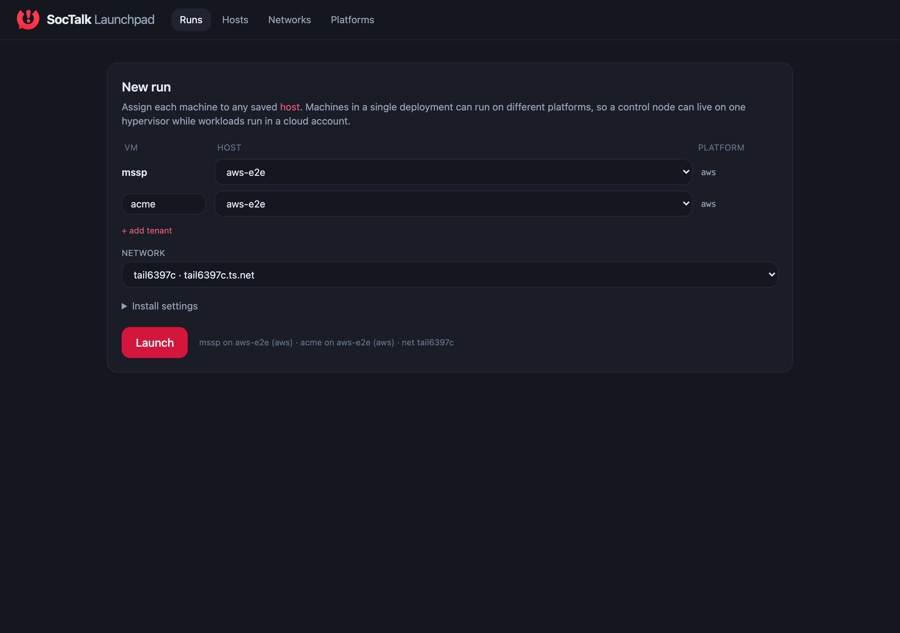
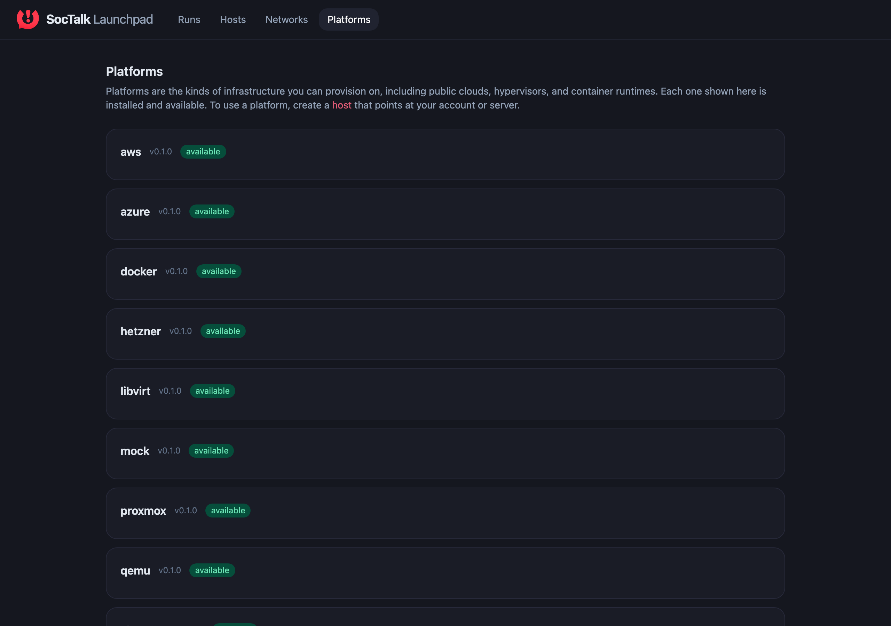
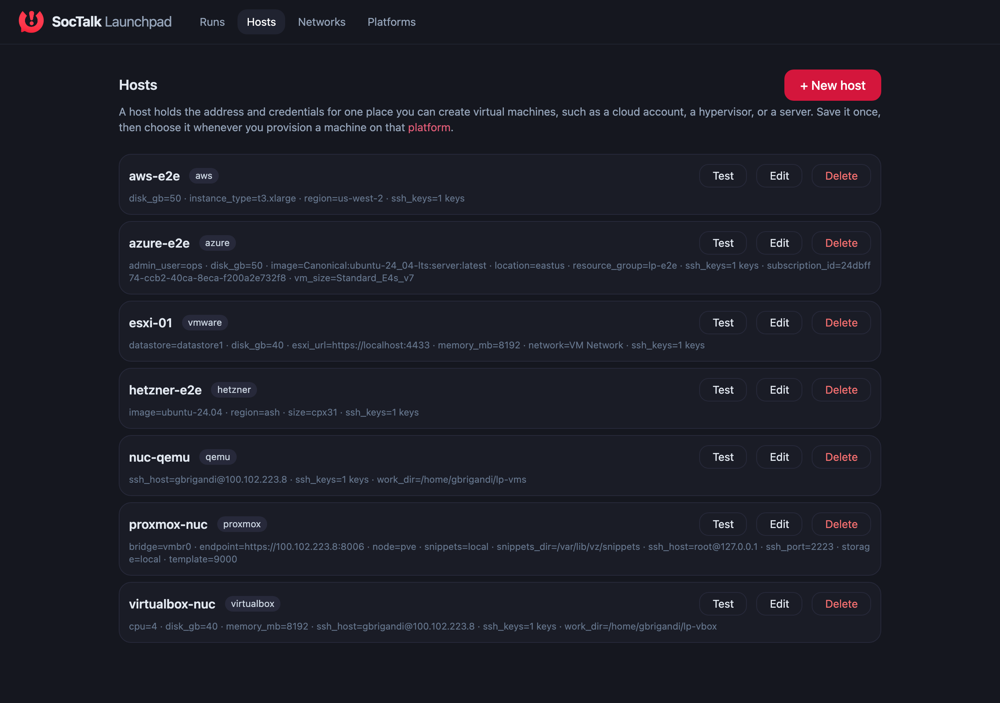
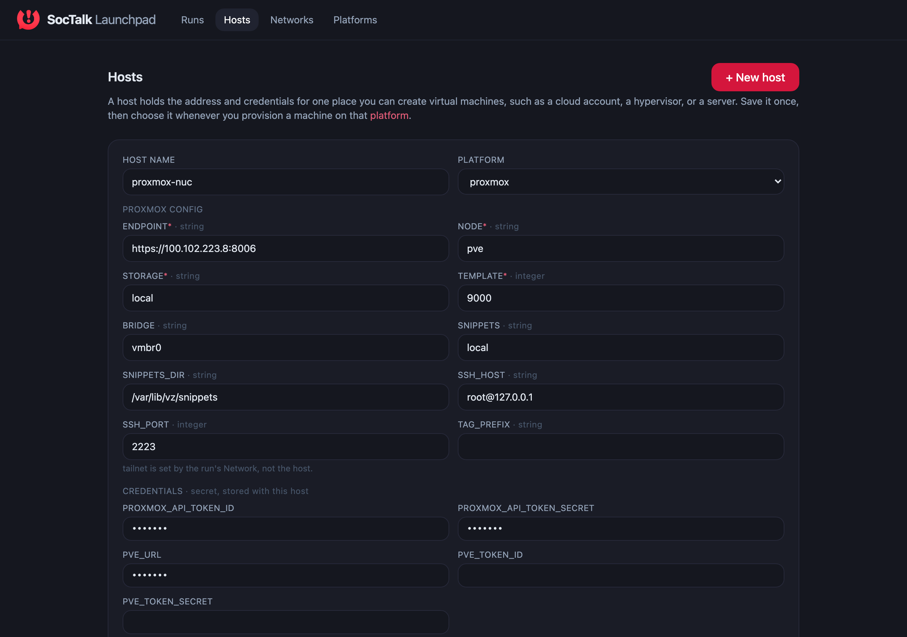
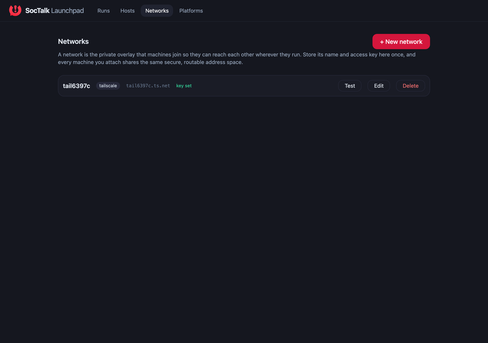

# SocTalk Launchpad

Launchpad provisions virtual machines across clouds and hypervisors, joins them to a private overlay network, and installs SocTalk on them end to end. It ships as a single Go binary with the web console built in, so a full deployment needs no external services beyond the target infrastructure and a Tailscale key.



## What it does

A deployment consists of one control node and one or more tenant nodes. Launchpad creates each machine on the host you assign it to, waits for it to come online on the overlay network, then installs the SocTalk control plane and the tenant SOC stack over SSH. Every machine in a deployment reaches the others through the same overlay, so the tenants can register with the control node regardless of which platform each one runs on.

The same run can mix platforms. A control node can run on a local hypervisor while tenants run in different cloud accounts, because placement is decided per machine at launch time rather than fixed in advance.

## Core concepts

Launchpad separates the reusable pieces of a deployment into four resources. The web console has a tab for each.

### Platforms

A platform is a kind of infrastructure you can provision on: a public cloud, a hypervisor, or a container runtime. Each platform is a plugin that self-describes the configuration it accepts. The list is read-only and reflects what is installed and available.



| Platform | Provisions on |
| --- | --- |
| `aws` | Amazon EC2 |
| `azure` | Azure Virtual Machines |
| `hetzner` | Hetzner Cloud |
| `vmware` | VMware ESXi |
| `proxmox` | Proxmox VE |
| `virtualbox` | Oracle VirtualBox |
| `qemu` | QEMU / KVM on a Linux host |
| `libvirt` | libvirt / KVM |
| `wsl2` | QEMU inside Windows WSL2 |
| `docker` | Docker daemon |
| `mock` | In-memory reference plugin for the compliance suite |

### Hosts

A host holds the address and credentials for one place you can create virtual machines, such as a cloud account, a hypervisor, or a server. Configure it once, then choose it when you place a machine. Credentials are stored with the host and never leave the machine that runs Launchpad. The **Test** button validates the connection before you commit to a run.



Every configuration field a host holds is editable, and new hosts pre-fill the fields their platform expects.



### Networks

A network is the private overlay that machines join so they can reach each other wherever they run. Store the overlay name and its access key once, and every machine you attach shares the same routable address space. A run binds to one network, and all of its machines join that network.



### Runs

A run is a single deployment. You assign the control node and each tenant to a host, pick a network, and launch. Launchpad streams progress as it provisions each machine, waits for it to come online, and installs SocTalk. Runs are idempotent: re-launching the same run reconciles against machines that already exist rather than duplicating them, and the **Down** action tears a run's machines back down.

## Quickstart

### Web console

```bash
export LAUNCHPAD_PLUGIN_DIR=/path/to/plugins-with-manifests
./cli/bin/launchpad ui
```

This starts the console and opens it in your browser. From there:

1. Open **Networks**, add your overlay name and access key, and use **Test** to confirm the key works.
2. Open **Hosts**, add a host for each place you want to provision on, and **Test** each one.
3. Open **Runs**, assign the control node and tenants to hosts, pick the network, and press **Launch**.

The console is served from the same binary, so nothing else needs to be installed to use it.

### Headless

For automation, drive a run from a YAML config without the console:

```bash
export TAILSCALE_API_KEY=tskey-api-...
export LAUNCHPAD_PLUGIN_DIR=/path/to/plugins-with-manifests

./cli/bin/launchpad up --config pilot.yaml --headless --auto-resolve-gates
```

## Layout

```
launchpad/
├─ cli/           # launchpad binary (Go); embeds the web console
├─ sdk-go/        # plugin SDK for Go
├─ sdk-py/        # plugin SDK for Python (interop tested against the Go suite)
├─ frontend/      # web console (SvelteKit); built output is embedded in the binary
├─ plugins/       # one directory per platform (see the table above)
├─ docs/          # documentation and screenshots
└─ README.md
```

Each Go module builds standalone. Local development uses `replace` directives (`cli/go.mod` points at `../sdk-go`; `plugins/*/go.mod` point at `../../sdk-go`).

## Build

The web console is embedded into the CLI binary at build time, so the finished binary serves the full UI with no external files. Rebuild the console before the CLI when the frontend changes:

```bash
# 1. build the console and copy it into the embed directory
cd frontend && pnpm install && pnpm build
rm -rf ../cli/internal/httpapi/frontend_build
cp -r build ../cli/internal/httpapi/frontend_build

# 2. build the CLI (the console is now compiled in)
cd ../cli && go build -o bin/launchpad ./cmd/launchpad

# 3. build any plugin
cd ../plugins/qemu && go build -o bin/plugin .
```

To confirm the console is self-contained, run the binary from an empty directory: it serves the SPA and its assets straight from the embed.

## Plugin protocol

Plugins speak line-delimited JSON-RPC 2.0 over stdio, in the style of the Language Server Protocol rather than gRPC. A plugin advertises its capabilities and configuration schema in an initial hello frame, so adding a platform is a matter of dropping in a plugin with no change to the console.

- **Wire spec and method reference:** [`plan.md`](./plan.md)
- **Compliance suite:** `cli/internal/pluginhost/verify.go`, run against any plugin with `launchpad plugin verify <name>`. It passes without live credentials by treating auth and validation errors from initialize as expected.
- **Reference plugin:** `plugins/mock/main.go`, a small deterministic plugin used by the suite.

Plugins can be written in any language. The Python SDK in `sdk-py/` includes a plugin that passes the same Go compliance suite.

## Tests

```bash
cd sdk-go && go test ./...
cd sdk-py && pytest
```
